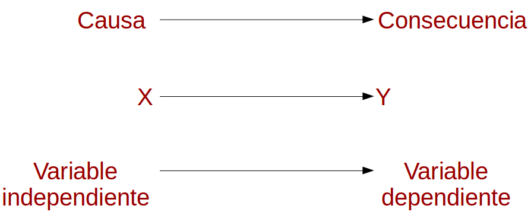
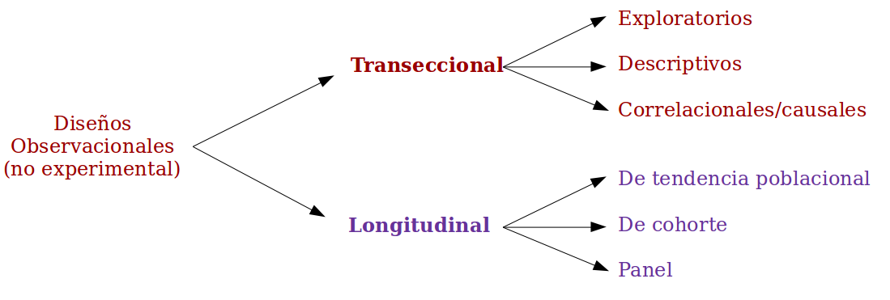

class: bottom, right

```{r setup, include=FALSE, cache = FALSE}
require("knitr")
options(htmltools.dir.version = FALSE)
pacman::p_load(RefManageR)
# bib <- ReadBib("meritocracy.bib", check = FALSE)
```

```{r eval=FALSE, echo=FALSE}
# Correr esta linea para ejecutar
rmarkdown::render('01_intro.Rmd', 'xaringan::moon_reader')
```


<!---
About macros.js: permite escalar las imágenes como [:scale 50%](path to image), hay si que grabar ese archivo js en el directorio.
--->

.right[]

<br>
<br>
<br>


# Estrategias de investigación cuantitativa
## Carrera de Sociología, 2 sem. 2019

## Prof. Juan Carlos Castillo

## **Tema 2**: Formulación de una investigación cuantitativa

---
class: roja, middle, center, slideInRight

#  ... resumen sesión anterior

---
# **ESTE CURSO**

<br>
## - Caracterización investigación cuantitativa (Unidad 1)

## - Medición y operacionalización (Unidad 2)

## - Implementación (Unidad 3)

<br>

### **web: estrategias-ic.netlify.com**
---
# Flujo investigación cuantitativa

<br>
<br>


---
# Problema de investigación

<br>
## - Relación entre 2 o más conceptos

## - Contrastable empíricamente

## - Relevante

## - Viable

## - Se resume en una pregunta de investigación

---
# Problema de investigación: elementos

|  | Componente  |Formas ... |
|----|---|---|
|1. Contexto: | **qué**     | "En Chile" "la salud" "Los votantes"   |
|2. Disciplina:| **desde dónde**   | "La sociología..."   |
|   |    | "hasta ahora la evidencia señala..." |
|3. Novedad:   | **aporte**| "Sin embargo, aún no se conoce..."   |
|4. Objetivos: | **meta**  | "Esta investigación busca ..." |
|   |   | “describir”, “demostrar”,|
|   |   |  “examinar”,  "especificar”,|
|   |   | “relacionar”, “analizar”, “comparar”  |

# -> PREGUNTA de investigación

---
class:inverse, right

# Esta clase (primera parte)

<br>

## 1. Planteamiento y análisis de problemas de investigación

## 2. Definición del alcance de la investigación

## 3. Hipótesis de investigación

---


class: roja, middle, center

## Actividad práctica:

# Planteamiento de un *problema* de investigación


???
- En duplas realizar ejercicio de plantear un problema de investigación
- hacer énfaisis entre tema de investigación y problema de investigación (disciplinar)

---
class: roja, center

<br>
<br>
<br>


# UN TEMA NO ES UN PROBLEMA DE INVESTIGACION

--

## Clave: la resolución del problema constituye una constribución RELEVANTE al/desde el conocimiento (académico)

---
# Sobre la relevancia del problema

.left-column[
## Hombros de gigante
]

.right-column[
.right[

]
]
---
# Sobre la relevancia del problema

.left-column[
## Hombros de gigantes
## Brecha
]

.right-column[
.right[

]
]

---
# Sobre la relevancia del problema

.left-column[
## Hombros de gigantes
## Brecha
## Ell_s dicen, yo digo
]

.right-column[
.right[

]
]

---
# Actividad práctica 2: Revisión de planteamiento de problema

###  Gayo Cal, M., G. Otero Cabrol y M. L. Méndez. 2019. “Elección escolar y selección de familias: reproducción de la clase media alta en Santiago de Chile”. Revista Internacional de Sociología 77(1):e120.


---
class: inverse, middle, center

# 2. Alcance de la investigación

---
# Estudios descriptivos


.right[
]
]

---
# Estudios correlacionales
<br>


---
# Estudios explicativos

<br>
.center[

]
---
# Alcances


---
class: middle, center

# 3. Hipótesis


---
## Alcances e hipótesis

<br>


---
# Características hipótesis

- Afirmación sobre resultados (generales) del estudio:

  - Más del 50% de los hombres fuman durante la adolescencia en Santiago (descriptiva)
  - A mayor nivel socioeconómico, mayor participación política (correlacional)
  - La participación en preuniversitarios mejora el puntaje PSU (explicativa)

- Basadas en **antecedentes** conceptuales presentados previamente

- **Contrastables** empíricamente

- **Breves**, no contener argumentos (los argumentos son previos)

- **Útiles**: permiten definir hacia donde apuntan los análisis

---
# ... y siempre evitar

.center[

]
---
class: inverse

# RESUMEN

- Características y relevancia de un problema de investigación

- Tipos de estudios en relación a distintos problemas

- Hipótesis de investigación

???

Ideas:
- Características de hipótesis
- revisión de artículo


---

class:inverse, right

# Esta clase (segunda parte)


<br>

<br>

# **Diseños de investigación social**

<br>

## ¿Qué voy a hacer para contrastar mis hipótesis de investigación?

---
# Tipos de diseños de investigación cuantitativa

- Experimentales

- Observacionales (no experimentales)

  - Transeccionales

  - Longitudinales

---
# Diseños experimentales

.center[

]
---
# Diseños experimentales


<br>



---
# Diseños experimentales

## Implementación

- Laboratorio

- Campo

- Encuestas


---
# Diseños experimentales: tipos "puros"


---
# Diseños experimentales: tipos "puros"

## Características

### 1. Manipulación de la variable independiente (tratamiento)

  - Presencia  / ausencia (1 o 0)
  - Diferentes grados / niveles de la variable independiente (0 a _n_)
  - Diferentes tipos


### 2. Medir efecto del tratamiento

### 3. Aleatorización de los grupos (validez interna)


---
# Diseños experimentales: tipos "puros"

## Modalidades

- Sin pretest

- Con pretest --> problema: efecto "pretest"

- 4 grupos (Solomon):
.center[


]
---
# Diseños experimentales: preexperimentos

.center[

]

---
# Diseños experimentales: cuasiexperimentos

- grupos sin asignación aleatoria previa ("experimento natural")

<br>


---
# Observacionales (no experimentales)

<br>



---
class: inverse

# Resumen

- Diseños experimentales: causa-consecuencia
  - experimentos puros
  - pre-experimentos
  - cuasi-experimentos
  
- Diseños observacionales 
  - transeccionales
  - longitudinales


---
.right[]

<br>
<br>
<br>


# Estrategias de investigación cuantitativa
## Carrera de Sociología, 2 sem. 2019

## Prof. Juan Carlos Castillo
