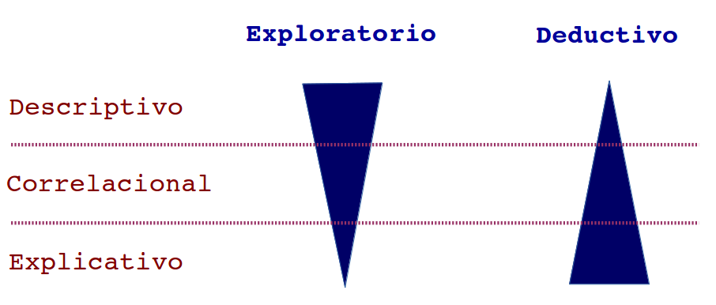

class: bottom, right

```{r setup, include=FALSE, cache = FALSE}
require("knitr")
options(htmltools.dir.version = FALSE)
pacman::p_load(RefManageR)
# bib <- ReadBib("meritocracy.bib", check = FALSE)
```

```{r eval=FALSE, echo=FALSE}
# Correr esta linea para ejecutar
rmarkdown::render('static/docpres/03_operac/03operac.Rmd', 'xaringan::moon_reader')
```


<!---
About macros.js: permite escalar las imágenes como [:scale 50%](path to image), hay si que grabar ese archivo js en el directorio.
--->

.right[]

<br>
<br>
<br>


# Estrategias de investigación cuantitativa
## Carrera de Sociología, 2 sem. 2019

## Prof. Juan Carlos Castillo

## **Tema 3**: Operacionalización


---
# **ESTE CURSO**

<br>
## - Caracterización investigación cuantitativa (Unidad 1)
  - Problema, hipótesis, diseño, ética

## - Medición y operacionalización (Unidad 2)

## - Implementación (Unidad 3)

<br>

### **web: estrategias-ic.netlify.com**

---
class: roja, middle, center, slideInRight

#  RESUMEN

---
# Flujo investigación cuantitativa

<br>
<br>


---
# Problema de investigación

<br>
## - Relación entre 2 o más conceptos

## - Contrastable empíricamente

## - Relevante

## - Viable

## - Se resume en una pregunta de investigación

---
# Sobre la relevancia del problema

.left-column[
## Hombros de gigante
]

.right-column[
.right[

]
]
---
# Sobre la relevancia del problema

.left-column[
## Hombros de gigantes
## Brecha
]

.right-column[
.right[

]
]

---
# Sobre la relevancia del problema

.left-column[
## Hombros de gigantes
## Brecha
## Ell_s dicen, yo digo
]

.right-column[
.right[

]
]

---
# Alcances de la investigación



---
# Hipótesis: características

- Afirmación sobre **resultados (generales)** del estudio:

  - Más del 50% de los hombres fuman durante la adolescencia en Santiago (descriptiva)
  - A mayor nivel socioeconómico, mayor participación política (correlacional)
  - La participación en preuniversitarios mejora el puntaje PSU (explicativa)

--

- Basadas en **antecedentes** conceptuales presentados previamente

--

- **Contrastables** empíricamente

--

- **Breves**, no contener argumentos (los argumentos son previos)

--

- **Útiles**: permiten definir hacia donde apuntan los análisis


---
# Diseños de investigación: Experimentales

<br>

.medium[

|                                        | Experimentos | Cuasi-experimentos | Pre-experimentos |
|----------------------------------------|--------------|--------------------|------------------|
| Manipulación de variable independiente |       *      |                    |                  |
| Grupo de comparación                   |       *      |          *         |                  |
| Medición de variable dependiente       |       *      |          *         |         *        |

]

---
# Diseños de investigación: Observacionales

<br>


---
class: inverse

# Esta sesión:

## Comenzamos unidad 2: Medición y operacionalización

- ### Variables yniveles de medición

- ### Operacionalización

- ### Confiabilidad y validez


---
class: roja, middle, center


# 1. Variables y niveles de medición

---
# Medir

.pull-left[
-   “asignar números, símbolos o valores a las propiedades de objetos o eventos de acuerdo con reglas” (Stevens, 1951)

- Vincula conceptos abstractos con indicadores empíricos
]

.pull-right[

]
---
# Medir: requisitos básicos

<br>

- **Exhaustividad**: el mayor número de categorías significativas.
  - Ej: ¿Qué categorías se deben considerar para población migrante?

- **Exclusividad**: atributos mutuamente excluyentes


---

# Variable: atributo que varía en las unidades de análisis

## --> posee VARIANZA (en variables cuantitativas)

.pull-left[

]

.pull-right[

$$\begin{split}
\sigma^2&=\frac{\sum_{i=1}^{n}(x_i - \bar{x})(x_i - \bar{x})} {n-1} \\
&=\frac{\sum_{i=1}^{n}(x_i - \bar{x})^2} {n-1}
\end{split}$$

]

---
# Niveles de medición de las variables


---
# Niveles de medición de las variables

.center[

]
---
# Niveles de medición de las variables

.center[

]


---
class: roja, middle, center

# 2. Operacionalización


---
# Operacionalización

.center[]


---
# Operacionalización

.center[]


---
class: inverse, middle

# Actividad Práctica: Operacionalización


## Identificar conceptos centrales del problema de investigación a abordar

## Operacionalizar los conceptos en dimensiones e indicadores


---
class: roja, middle, center

# Confiabilidad y validez

---
# Confiabilidad y Validez

.center[]

--
## ¿Cómo asegurar la confiabilidad y validez de mi instrumento de medición?

--


## --> próxima sesión

---
class:inverse

# RESUMEN


### - MEDIR:
  - asignar números a características / atributos según reglas

--

### - Variables:
  - característica que tiene diferentes valores de medición en las uniades de análisis

--

### - Niveles de medicion: NOIR (Nominal, Ordinal, Intervalar, Razón)

--

### - Operacionalización:
  - de los conceptos a su medición


---
.right[]

<br>
<br>
<br>


# Estrategias de investigación cuantitativa
## Carrera de Sociología, 2 sem. 2019

## Prof. Juan Carlos Castillo
