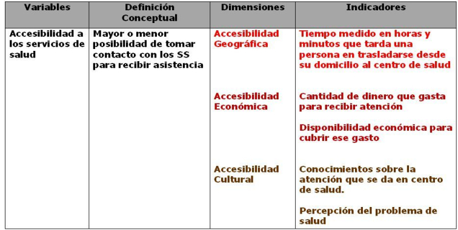
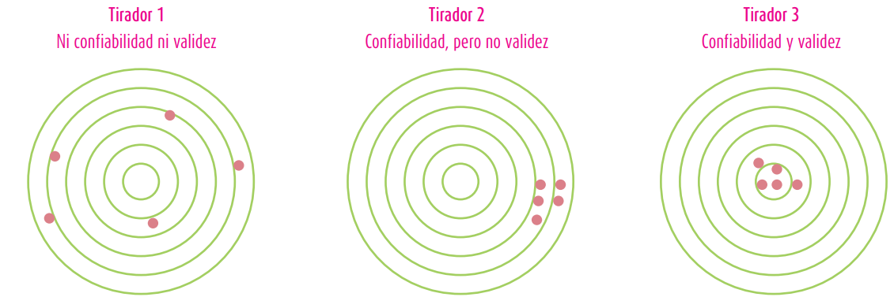

class: bottom, right

```{r setup, include=FALSE, cache = FALSE}
require("knitr")
options(htmltools.dir.version = FALSE)
pacman::p_load(RefManageR)
# bib <- ReadBib("meritocracy.bib", check = FALSE)
```

```{r eval=FALSE, echo=FALSE}
# Correr esta linea para ejecutar
rmarkdown::render('static/docpres/03_operac/03operac.Rmd', 'xaringan::moon_reader')
```
 

<!---
About macros.js: permite escalar las imágenes como [:scale 50%](path to image), hay si que grabar ese archivo js en el directorio.
--->

.right[]

<br>
<br>
<br>


# Estrategias de investigación cuantitativa
## Carrera de Sociología, 2 sem. 2019

## Prof. Juan Carlos Castillo

## **Tema 4**: Operacionalización 2, confiabilidad & validez


---
# **ESTE CURSO**

<br>
## - Caracterización investigación cuantitativa (Unidad 1)
  - Problema, hipótesis, diseño, ética

## - Medición y operacionalización (Unidad 2)

## - Implementación (Unidad 3)

<br>

.right[

[WEB: estrategias-ic.netlify.com](https://estrategias-ic.netlify.com/)

]

---
class: roja, middle, center, slideInRight

#  RESUMEN

---
# Flujo investigación cuantitativa

.left-column[
### Problema de investigación
]

.right-column[
- Tema vs problema

{{content}}
]
--
- Relación entre 2 o más conceptos

{{content}}
--

- Contrastable empíricamente

{{content}}
--
- Relevante
  - Hombros de gigante
  - Brecha
  - Ellos dicen, yo digo

{{content}}
--
- Viable

{{content}}
--
- Se resume en una pregunta de investigación

---
# Flujo investigación cuantitativa

.left-column[
### Problema de investigación

### Revisión de antecedentes
]

.right-column[
- Conceptuales

- Empíricos
]

---
# Flujo investigación cuantitativa

.left-column[
### Problema de investigación

### Revisión de antecedentes

### Hipótesis
]

.right-column[
- Afirmación sobre **resultados (generales)** del estudio:

- Basadas en **antecedentes** conceptuales presentados previamente

- **Contrastables** empíricamente

- **Breves**, no contener argumentos (los argumentos son previos)

- **Útiles**: permiten definir hacia donde apuntan los análisis

]

---
# Flujo investigación cuantitativa

.left-column[
### Problema de investigación

### Revisión de antecedentes

### Hipótesis

### Diseño & alcances
]

.right-column[

### Alcances


]
---
# Flujo investigación cuantitativa

.left-column[
### Problema de investigación

### Revisión de antecedentes

### Hipótesis

### Diseño & alcances
]

.right-column[
.medium[
### Diseños experimentales

|                                        | Experimentos | Cuasi-experimentos | Pre-experimentos |
|----------------------------------------|--------------|--------------------|------------------|
| Manipulación de variable independiente |       *      |                    |                  |
| Grupo de comparación                   |       *      |          *         |                  |
| Medición de variable dependiente       |       *      |          *         |         *        |

]
]

---
# Flujo investigación cuantitativa

.left-column[
### Problema de investigación

### Revisión de antecedentes

### Hipótesis

### Diseño & alcances
]

.right-column[
### Diseños observacionales
<br>


]

---
# Flujo investigación cuantitativa

.left-column[
### Problema de investigación

### Revisión de antecedentes

### Hipótesis

### Diseño & alcances

### **Operacionalización**
]

.right-column[
- *Medición*:

  - asignar **números** a características en base a reglas 
  - categorías excluyentes y exhaustivas

{{content}}
]
--
- *Niveles de medición: **NOIR***
  - Nominal, ordinal, intervalar, razón

{{content}}
--

- *Operacionalización*

  - Establecer dimensiones, subdimensiones e indicadores para los conceptos en estudio


---
# Operacionalización

<br>

.center[]

---
class: inverse

# Esta sesión:

<br>

## - Confiabilidad y validez

## - Tabla de operacionalización


---
class: roja, middle, center

# Confiabilidad y Validez

---
# Confiabilidad y Validez

<br>

.center[]

---
# Fuentes de error

.center[**Marco de error total de encuestas:**]

.center[]

.small[
Groves, R. et al .(2004), Survey Methodology, New York: Wiley.
]
---
class: inverse, middle, center

# Confiabilidad y validez se relacionan con el 
#_Error de medición_

---
# Confiabilidad

-La confiabilidad puede ser definida como el grado de **consistencia** entre mediciones del mismo atributo

--


---
# Confiabilidad


---

---
class:inverse

# RESUMEN


---
.right[]

<br>
<br>
<br>


# Estrategias de investigación cuantitativa
## Carrera de Sociología, 2 sem. 2019

## Prof. Juan Carlos Castillo
