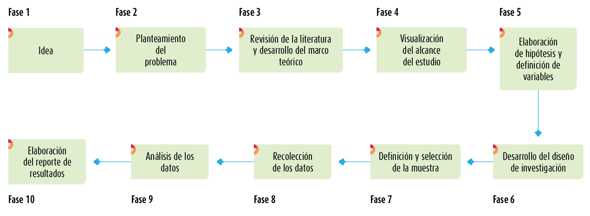
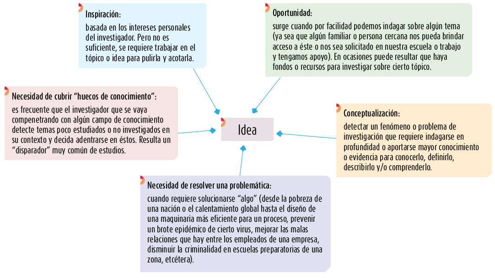

class: bottom, right

```{r setup, include=FALSE, cache = FALSE}
require("knitr")
options(htmltools.dir.version = FALSE)
pacman::p_load(RefManageR)
# bib <- ReadBib("meritocracy.bib", check = FALSE)
```

```{r eval=FALSE, echo=FALSE}
# Correr esta linea para ejecutar
rmarkdown::render('01_intro.Rmd', 'xaringan::moon_reader')
```


<!---
About macros.js: permite escalar las imágenes como [:scale 50%](path to image), hay si que grabar ese archivo js en el directorio.
--->

.right[]

<br>
<br>
<br>


# Estrategias de investigación cuantitativa
## Carrera de Sociología, 2 sem. 2019

## Prof. Juan Carlos Castillo

## **Sesión 1**: Introducción

---
class: roja, middle, center, slideInRight

#  ¿Cuáles son las principales características de una investigación cuantitativa?

---
class: inverse, middle, right

## "Para ser honestos, no poseemos un criterio que nos permita medir exactamente el grado de felicidad de una sociedad. Pero es posible estimar comparativamente el estado de salud o enfermedad en que se encuentra, para lo que tenemos a disposición un hecho bien conocido que traduce el malestar social en cifras: a saber, el número relativo de suicidios ..."

_Durkheim, 1888_

---
# Números

.center[]

???
- Asignar números a características, fenómenos, atributos. Ej: hombre/mujer= 1/0
- qué pasaría si no pudieramos "contar" fenómenos sociales? (ej: delincuencia, pobreza, ideologías políticas). Idea de "domesticación de la casualidad "

---
# Instrumentos

<br>
<br>

.center[]
---
# (Pretensión de) Validez

<br>
<br>
.center[]

---
class: inverse, right, middle

# **ESTE CURSO**

<br>
## - Caracterización (Unidad 1)

## - Medición y operacionalización (Unidad 2)

## - Implementación (Unidad 3)

<br>

### **web: estrategias-ic.netlify.com**
---
class: roja, middle, center

# Proceso

---
# Flujo investigación cuantitativa

<br>
<br>



---
# Lo primero: la IDEA

.center[]

---
# Problema de investigación

.center[]

---
# Problema de investigación

<br>
## - Relación entre 2 o más conceptos

## - Contrastable empíricamente

## - Relevante

## - Viable

## - Se resume en una pregunta de investigación

---
# Problema de investigación: elementos

|  | Componente  |Formas ... |
|----|---|---|
|1. Contexto: | **qué**     | "En Chile" "la salud" "Los votantes"   |
|2. Disciplina:| **desde dónde**   | "La sociología..."   |
|   |    | "hasta ahora la evidencia señala..." |
|3. Novedad:   | **aporte**| "Sin embargo, aún no se conoce..."   |
|4. Objetivos: | **meta**  | "Esta investigación busca ..." |
|   |   | “describir”, “demostrar”,|
|   |   |  “examinar”,  "especificar”,|
|   |   | “relacionar”, “analizar”, “comparar”  |


# -> PREGUNTA de investigación

---
class: roja, middle, center

# Actividad práctica: Planteamiento de un problema de investigación

---
class: inverse, right

# Resumen

<br>

## Investigación cuantitativa: características, medición e implementación.

## Flujo secuencial establecido

## Problema de investigación

---

.right[]

<br>
<br>
<br>


# Estrategias de investigación cuantitativa
## Carrera de Sociología, 2 sem. 2019

## Prof. Juan Carlos Castillo

## **Sesión 1**: Introducción
