class: bottom, right

```{r setup, include=FALSE, cache = FALSE}
require("knitr")
options(htmltools.dir.version = FALSE)
pacman::p_load(RefManageR)
# bib <- ReadBib("meritocracy.bib", check = FALSE)
```

```{r eval=FALSE, echo=FALSE}
# Correr esta linea para ejecutar
rmarkdown::render('static/docpres/05_preg/05preg.Rmd', 'xaringan::moon_reader')
```


<!---
About macros.js: permite escalar las imágenes como [:scale 50%](path to image), hay si que grabar ese archivo js en el directorio.
--->

.right[]

<br>
<br>
<br>


# Estrategias de investigación cuantitativa
## Carrera de Sociología, 2 sem. 2019

## Prof. Juan Carlos Castillo

## **Tema 5**: Preguntas y escalas


---
# **ESTE CURSO**

<br>
## - Caracterización investigación cuantitativa (Unidad 1)
  - Problema, hipótesis, diseño, ética

## - **Medición y operacionalización (Unidad 2)**
  - Validez, confiabilidad, preguntas y cuestionario

## - Implementación (Unidad 3)


.right[
[WEB: estrategias-ic.netlify.com](https://estrategias-ic.netlify.com/)

]

---
class: roja, middle, center, slideInRight

# RESUMEN

---
# Flujo investigación cuantitativa

.left-column[
### Problema de investigación

### Revisión de antecedentes

### Hipótesis

### Diseño & alcances

### **Operacionalización**
]

.right-column[
- *Medición*:

  - asignar **números** a características en base a reglas
  - categorías excluyentes y exhaustivas

{{content}}
]
--
- *Niveles de medición: **NOIR***
  - Nominal, ordinal, intervalar, razón

{{content}}
--

- *Operacionalización*

  - Establecer dimensiones, subdimensiones e indicadores para los conceptos en estudio


---
# Operacionalización

<br>

.center[]

---
# Confiabilidad y Validez

<br>

.center[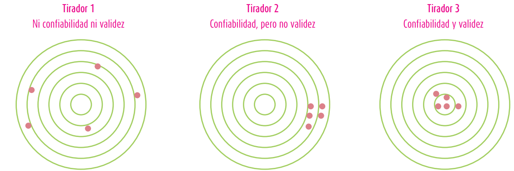]

---
# Fuentes de error

.center[**Marco de error total de encuestas:**]

.center[]

.small[
Groves, R. et al .(2004), Survey Methodology, New York: Wiley.
]

---
# Confiabilidad y validez

- *Confiabilidad*: consistencia del instrumento

  - Estabilidad
  - Formas paralelas
  - Consistencia interna

--
- *Validez*: evidencia acumulada para la interpretación de las puntuaciones

  - Contenido
  - Criterio
  - Estructura interna

---
class: inverse, right

# Esta sesión:

<br>

## - Preguntas y escalas

## - Actividad práctica: Diseño de preguntas

---
class: roja, middle, center

# PREGUNTAS

---
# Del problema a las **preguntas**


### - Problema <span>&#129095;</span>

### - Conceptos <span>&#129095;</span>

### - Operacionalización <span>&#129095;</span>

### - Indicadores <span>&#129095;</span>

### - Categorías de respuesta <span>&#129095;</span>

### - **Preguntas** <span>&#129095;</span>

### - Cuestionario


---
## Operacionalización y categorías de respuesta


.center[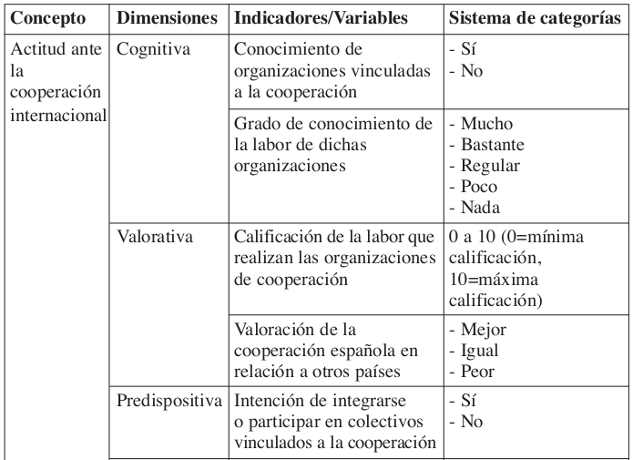]


---
# Contexto general: cuestionario

- Las **preguntas** conforman el aspecto central del cuestionario

- **Cuestionario**: instrumento que contiene las preguntas de investigación y otros aspectos relevantes para el estudio

- El cuestionario posee distintas posibilidades de **administración** (cara a cara, telefónico, online)

- Existen también recomendaciones para **ordenar** las preguntas en el cuestionario.

--

<br>
.right[
## Detalles cuestionario: *próxima sesión*
]

---
# Tipos generales de preguntas

.center[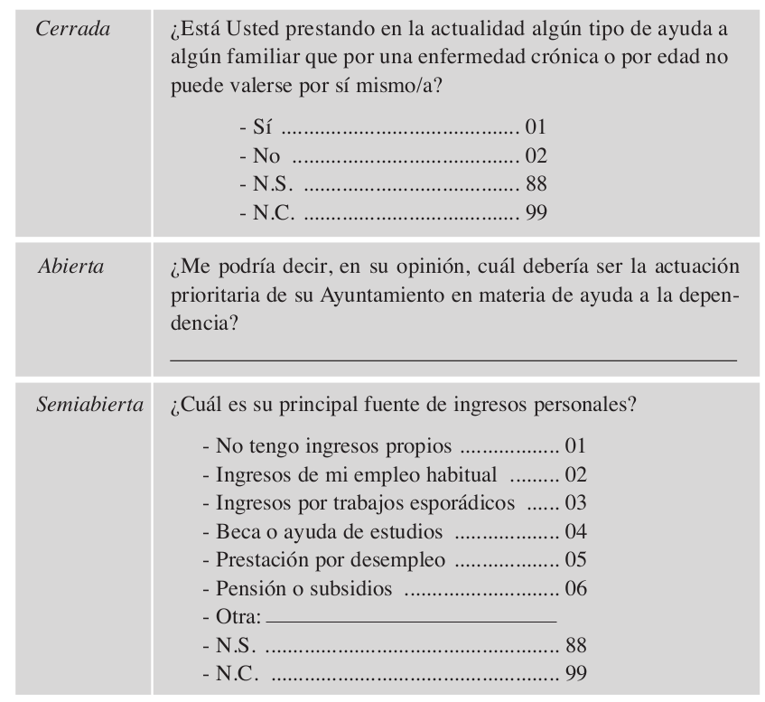]

---
class: middle, right
## En adelante nos enfocaremos en la construcción de preguntas **cerradas**
---
# Temas de preguntas

.center[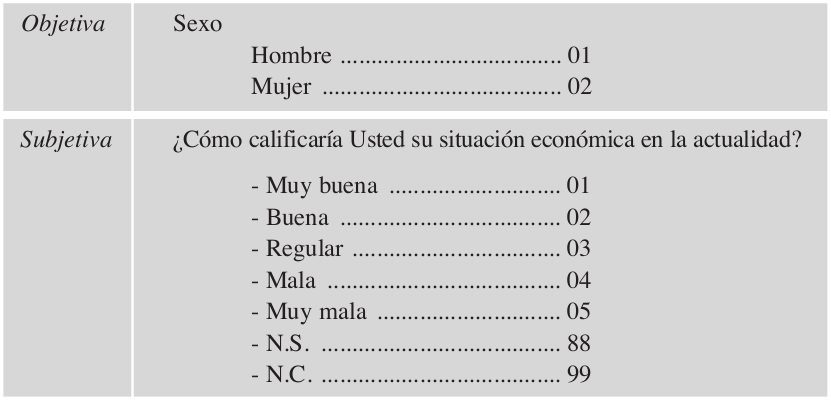]

---
## A. Temas _objetivos_

- Informacion sociodemográfica tradicional
  - ej: número de hijos, comuna de residencia, país de nacimiento, edad, nivel educacional

- Información caracterísitcas y atributos personales
  - ej: estatura, enfermedades, sistema salud (Isapre/Fonasa)

---
## B. Temas _subjetivos_

- **Comportamiento** - ej: votó en la última elección, asistentencia a servicios religiosos, participación en marchas

- **Opiniones** - ej: identificación izquierda-derecha, confianza en el gobierno, creencia en cambio climático

- **Sentimientos** -  ej: nivel de felicidad, cansancio, pertenencia

- **Conocimiento** - ej: quién es el presidente del senado
---
# Fuentes de Preguntas

- Estudios previos

  - Encuesta mundial de valores
  - Encuesta CEP
  - Latinobarómetro
  - ISSP (variados temas sociológicos como desigualdad, rol del gobierno, sistemas de salud)
  - CASEN
  - ELSOC

- Preguntas nuevas, creadas o modificadas de fuentes anteriores

---
# Generando preguntas

- Claras

- Simples

- Breves

- Categorías de respuesta excluyentes

- Preguntar una cosa a la vez (contraej: ¿Se siente cansado y aburrido?)

- Evitar inducción de sesgos o _cargas_ (contraej: ¿Cuánto _disfrutó_ la película?)

- Considerar deseabilidad social


---
# Generando Preguntas

- Evaluar quién responde condicional a otras respuestas mediante **filtros**

.center[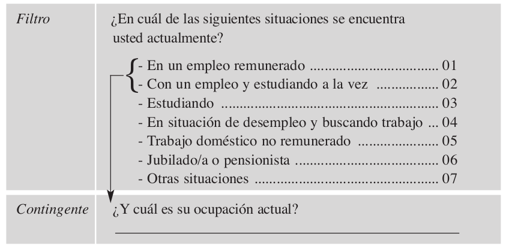]


---
# Tipos de preguntas

- Opciones múltiples
  - selección única
  - selección múltiple

- Ranking o ordenación

- Escalas de valoración

---
# Tipos de preguntas

### Opciones múltiples: **selección única**

.center[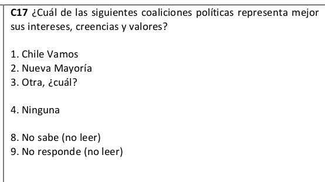]

---
# Tipos de preguntas

### Opciones múltiples: **selección múltiple**

.center[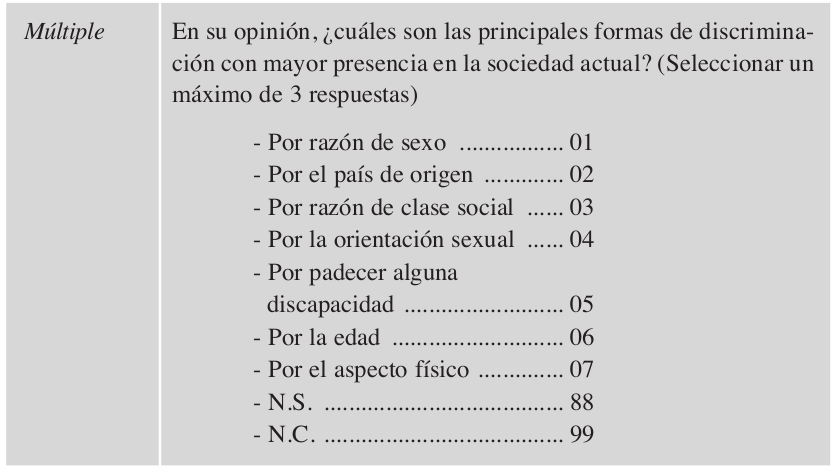]

---
# Tipos de preguntas

### Ranking o ordenación

.center[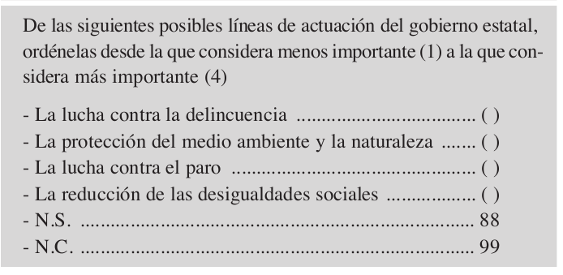]

---
# Tipos de preguntas

### Escalas de Valoración

  - *Escala*: "un conjunto coherente de elementos (ítems) que se consideran indicadores de un concepto más general" (Corbetta, 2003)

  - En general se utilizan para conceptos no observables directamente, como actitudes, motivaciones, posicionamientos

  - Se asume que el concepto a medir es latente y que es abordado por indicadores múltiples de manera indirecta

  - Tipos: Thurstone, Guttman, Likert, Osgood

---
# Tipos de preguntas

### Escalas: **Thurstone**

  - Se diseña un conjunto de items relacionados con el objeto estudiado

  - Valoración de expertos: ordenan de muy favorables a muy desfavorables y se seleccionan los items con mayor acuerdo (menor desviación)

  - Se calcula el puntaje de acuerdo a la ponderación otorgada por los jueces a cada item (_valor escalar_)

---

.center[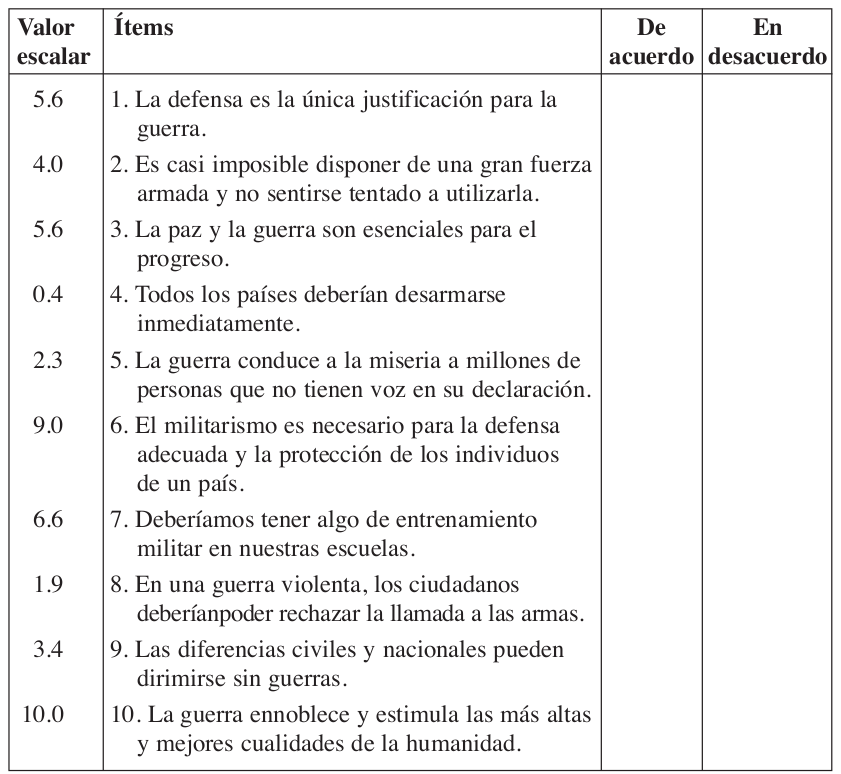]

---
# Tipos de preguntas

### Escalas: **Thurstone**

  - Puntuación: para la propuesta de la figura anterior, si un individuo muestra su acuerdo con los ítems 2, 4, 8 y 9, su puntuación en la escala sería:
    (4.0 + 0.4 + 1.9 + 3.4) / 4 = 2.4

  - Ventajas: medición ponderada de un constructo unidimensional

  - Desventajas: proceso de construcción

---
# Tipos de preguntas

### Escalas: **Guttman**

- Enunciados escalonados que representan valoración gradual

- Lógica: hay indicadores más débiles que otros, y un individuo que se adscriba a un indicador fuerte lo hará necesariamente a los indicadores más débiles

- Construcción: jueces establecen ranking, se eliminan aquellos indicadores que presentan mayor desviación.

---
# Tipos de preguntas

### Escalas: **Guttman**
.center[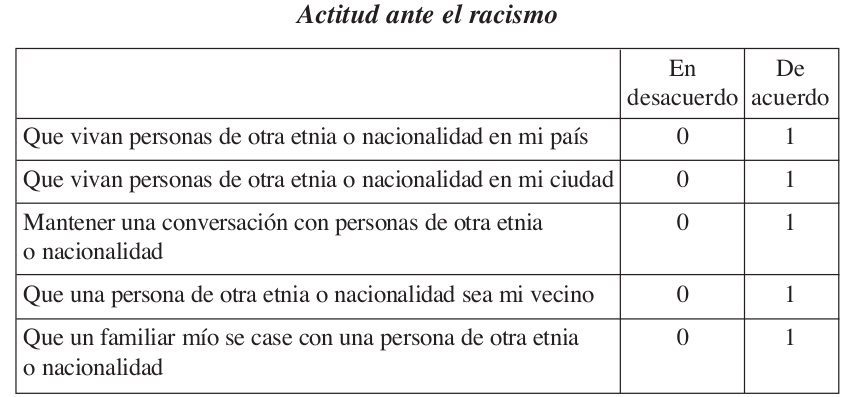]

---
# Tipos de preguntas

### Escalas: **Likert**

- expresan grados de **favorabilidad** o desfavorabilidad sobre el objeto propuesto, lo que desde el punto de vista de la medición le otorga una naturaleza ordinal.

- Las **opciones de valoración** habitualmente son 5 en un continuo de acuerdo-desacuerdo:

  - Totalmente de acuerdo
  - De acuerdo
  - Indiferente (ni de acuerdo ni en desacuerdo)
  - En desacuerdo
  - Totalmente en desacuerdo

---
.center[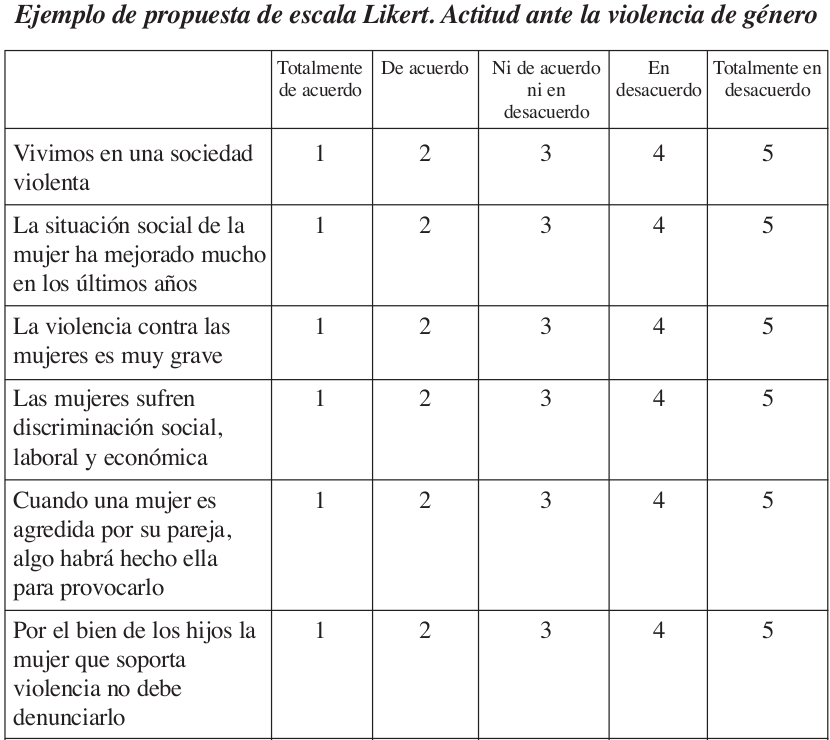]

---
# Tipos de preguntas

### Escalas: **Osgood (diferencial semántico)**

- Supone que la actitud se desarrolla sobre un continuo bipolar entre adjetivos antagónicos del objeto propuesto a medición

- Genera un espacio semántico que representa valoración e intensidad

- Construcción: se generan indicadores que luego son analizados mediante análisis factorial. Luego se disponen en una batería.

---
# Tipos de preguntas

### Escalas: **Osgood (diferencial semántico)**

Ejemplo: valoración de las personas mayores

.center[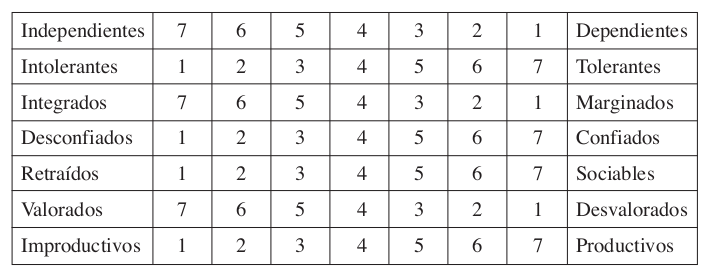]


---
.right[
# Revisión de preguntas]

.left-column[
## Contenido
]

.right-column[
• ¿Es necesaria esa pregunta?

• ¿Son necesarias más preguntas sobre esta cuestión?

• ¿Es necesario concretar más la pregunta?
]


---
.right[
# Revisión de preguntas
]
.left-column[
## Contenido

## Redacción
]

.right-column[
• ¿Se podría expresar de un modo más claro?, ¿Cómo?

• ¿Puede tener varias interpretaciones?

• ¿Presenta algún sesgo o prejuicio?

• ¿Las categorías de respuesta son exhaustivas?

• ¿Se solapan algunas categorías de respuesta?
]

---
.right[
# Revisión de preguntas
]

.left-column[
## Contenido

## Redacción

## Ubicación
]

.right-column[
• ¿La pregunta está situada en el lugar adecuado?

• ¿Pueden influir las preguntas preferentes?

• ¿Esta pregunta puede influir en preguntas posteriores?
]

---
class: roja, middle, center

## Actividad Práctica

<br>
# DISEÑO DE PREGUNTAS


---
.right[]

<br>
<br>
<br>


# Estrategias de investigación cuantitativa
## Carrera de Sociología, 2 sem. 2019

## Prof. Juan Carlos Castillo
